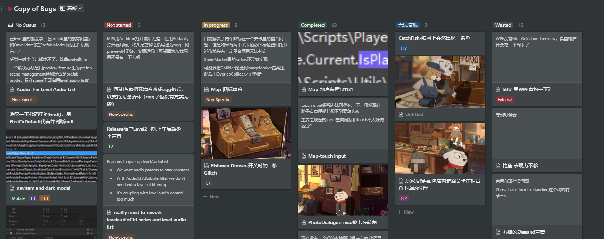
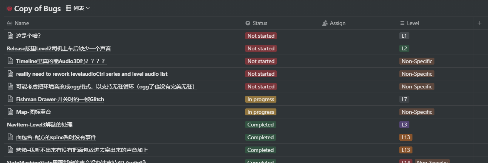

自己用的软件推荐

> 本页面出现的《落日山丘》相关内容并不包含机密内容，但可能包含剧透。

## Notion

*万用笔记软件 | 免费版/Pro版学生免费*

### Intro

如果愿意深入研究，Notion层级/数据库式的组织结构，加上各种Integration和共享发布，足以让它成为一个完整的管理应用。不管是跟踪项目进度还是整理一学期的课程信息都可胜任。


和室友的消费AA、房屋设施报修进度、（浪费钱的）购置提议还有各种信息的速查表都汇总于一个主页。仅仅通过在笔记页面内各种表格的排列组合和一些简单设置就达到了完整网站应用的效果（而且也能发布到网页）。



不追求过于复杂的应用的话，Notion本身简洁的界面和快捷指令让它也可以作为单纯的写作软件来使用，或者只是“突然想起来一个什么东西想写下来”也行。

如果特殊样式、链接、表格等等非图文内容比较多的话，我还是会选择VS Code来一步到位。


之前发布在知乎专栏的Missing Semester系列、平常工作时要写的一些文本内容（是的，程序员还要顺便干本地化和英文文案的活）、以及我的一部分博客文章，包括现在这篇，都是由Notion完成。


### Other Use Cases

需要更全面、严谨的项目管理或者要引入多人合作的时候（例如我的几个软件/游戏项目），我会使用Jira+Confluence来获得工作流管理+Git Integration。

工作上我用Notion内置的看板来追踪事务/Bug进度。因为Notion数据库的每个事务都是一个单独的笔记页面，让我可以很方便的在事务里面贴代码、截图、列表等等。在这种重视快捷事务信息呈现而不需要权限/时间管理的场合下，用Notion就比较舒服。

<figcaption class="primary">切换数据库的呈现形式</figcaption>

至于To do List我用Microsoft To Do，最早用的Wunderlist被并入To Do之后就一直沿用了。

除此之外就是单纯的当笔记数据库来用了，在每个服务商下面有哪些域名、服务器，它们每年几月份要续费；在每个网站用的密码是什么版本、注册用的是哪个邮箱（当然这一部分我脑内加密了，不知道我密码习惯的人看到了也认不出来）；甚至Dota2里每个英雄还要收集哪些饰品、打Lol的时候每个英雄的平均APM是多少我都用Notion来记录。

## PureRef

*让桌面变大的Magic | 免费*

### Intro

作为一个（伪）全栈开发，在工作中我需要以极高的频率查看：文案发来的对话列表、美术提供的场景概念图、动画标注的动作对照表、需要配合的其他程序写在各种地方的代码、引擎里组件的配置参考等等。且不说引擎本身和IDE就不止要占一个显示器，我还得永远在StackOverflow/Unity Scripting Reference/Microsoft Docs之间转来转去。如何快速且准确地找到目前所需的Reference就成为了非常头疼的问题。

PureRef本身是个偏美术的工具应用，做概念美术或者场景的朋友可能听说过的概率比较大。它的概念非常简单，就只是一个Overlay，里面可以随便贴东西；偏偏在上面描述的这个场景里，它可以说是最好的解决方案。

具体使用体验我直接放两个视频在这里。

### Use Cases

<a href="niceapp/PureRef-AddItem.webm" target="_blank">
<video class="primary" autoplay muted loop>
    <source src="niceapp/PureRef-AddItem.webm" type="video/webm">
    Error playing video
</video>
</a>
<figcaption class="primary">添加/浏览References</figcaption>

<a href="niceapp/PureRef-BgTask.webm" target="_blank">
<video class="primary" autoplay muted loop>
    <source src="niceapp/PureRef-BgTask.webm" type="video/webm">
    Error playing video
</video>
</a>
<figcaption class="primary">移动References，不影响主要工作流</figcaption>