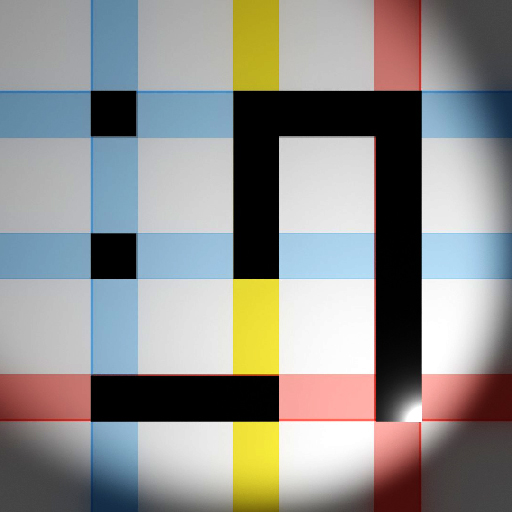

> 记录一下目前为止对主题的修改，方便之后查阅或定位问题。

## 全局

### 禁用Dark Mode

不喜欢黑色主题，在主题 `config.yml` 结尾处修改了 `darkmode: false` 。

### 添加自定义css文件

位于主题 `source/css/_fceek/` 下。

## 媒体

### 图片呈现

使用 `` 显示限宽600px，带阴影和Hover效果的图片。
使用 `<figcaption class="primary">` 在图片下方显示图注。



<figcaption class="primary"> Just a logo</figcaption>


<figcaption class="primary"> Just a logo</figcaption>

## 行文

使用 `
` 为其下方的一段正文添加边注。
`
` 是另一种样式的边注，用于总结或Paraphrasing。
使用 `<a class="doc-link">` 添加突出的独立链接。


这是第一段文字。

第二段的注解。这段注解长一些。这段注解长一些。这段注解长一些。这段注解长一些。

这是第二段文字。在屏幕宽度小于1200像素时，边注的样式会发生变化。缩小窗口来尝试这一特性。边注还有另一种样式，即TL;DR。

Note for paragraph 3.

This is the third paragraph.

<a class="doc-link" href="../index.html">回到Wiki</a>


这是第一段文字。

第二段的注解。这段注解长一些。这段注解长一些。

这是第二段文字。在屏幕宽度小于1200像素时，边注的样式会发生变化。缩小窗口来尝试这一特性。边注还有另一种样式，即TL;DR。

Note for paragraph 3.

This is the third paragraph.

<a class="doc-link" href="../index.html">回到Wiki</a>